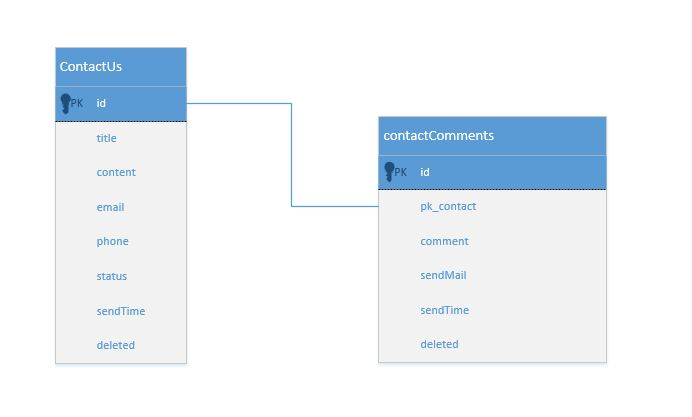

Parts Implemented by Seda Bilgin
================================

   

#########
ContactUS
#########
****************
Table Definition
****************

The ContactUs table is defined to have id, title, content, email, phone, status, sendTime, deleted columns.  The id increases serially, and the status assigned "New" by default.Status column data in ContactUs table is a type of contactStatus and contactStatus is defined with an enum type. ContactUs table is in schema.sql file.

.. code-block:: sql

	CREATE TYPE contactStatus AS ENUM ('new', 'replied', 'waiting', 'spam', 'closed');
	CREATE TABLE contactUs (
	  id       SERIAL PRIMARY KEY,
	  title    VARCHAR(100) NOT NULL,
	  content  VARCHAR(255) NOT NULL,
	  email    VARCHAR(50)  NOT NULL,
	  phone    VARCHAR(50)  NOT NULL,
	  status   contactStatus DEFAULT 'new',
	  sendTime timestamp     DEFAULT CURRENT_TIMESTAMP,
	  deleted  BOOLEAN       DEFAULT FALSE
	);
	
*******
Class
*******

"ContactMessage" class is under models/contact.py file. Class __init__()  is shown in below.

.. code-block:: python

    def __init__(self,cid=None,title=None,content=None,email=None,phone=None):
        if cid:
            self.cid = int(cid)
        if title:
            self.title=str(title)
        if content:
            self.content=str(content)
        if email:
            self.email=str(email)
        if phone:
            self.phone=str(phone)
        if cid:
            self.saved_message=True
            contact_info=self.get_info_by_id()
            if contact_info:
                self.title = contact_info[0]
                self.content = contact_info[1]
                self.email = contact_info[2]
                self.phone = contact_info[3]
                self.status =contact_info[4]
                self.sendTime = contact_info[5]
        else:
            self.saved_message=False

-------
Methods
-------

1. **Select**

- Select operation gets data from ContactUs table by id.

.. code-block:: python

    def get_info_by_id(self):
        try:
            db = get_database()
            cursor = db.cursor
            cursor.execute("SELECT title,content,email,phone,status,sendtime FROM {table} "+
	    		"WHERE id=%s".format(table=self.TABLE_NAME),[self.cid])
            contact_info= cursor.fetchone()
            if contact_info:
                return contact_info
        except:
            return False

- Selecting of rows with desired status or deleted marked of table. 

.. code-block:: python

	@staticmethod
    def get_messages(desired_status=None,get_deleted=False):
        accepted_status=[]
        all_status = ['new', 'replied', 'waiting', 'spam', 'closed']
        if not desired_status:
            desired_status = ['new','replied','waiting']
        for one_status in desired_status:
            if one_status in all_status:
                accepted_status.append(one_status)
        where =''
        if not get_deleted:
            where = 'deleted=False and (status=\''
        if len(accepted_status) > 0:
            where += '\' or status =  \''.join(accepted_status)
            where += '\')'
            try:
                db = get_database()
                cursor = db.cursor
                cursor.execute("SELECT id,title,content,email,phone,status,sendtime from"+
			" contactUs where  "+where)
                return cursor.fetchall()
            except:
                return []
        return []
			
			
2. **Insert**

- Insert operation adds data to ContactUs table.

.. code-block:: python
			
    def save(self):
        try:
            db = get_database()
            cursor = db.cursor
            cursor.execute("INSERT INTO {table} (title,content,email,phone) VALUES"+
	    	" (%s,%s,%s,%s)".format(table=self.TABLE_NAME),
	    	[self.title,self.content,self.email,self.phone])
            cursor.close()
            db.commit()
            db.close()
            return True
        except:
            return False
			
3. **Update**

- Update operation changes status of row by identified id if new status is one of contactStatus type.

.. code-block:: python

    def change_status(self,new_status):
        all_status=['new','replied','waiting','spam','closed']
        if new_status in all_status:
            self.status = new_status
            try:
                db = get_database()
                cursor = db.cursor
                cursor.execute("UPDATE {table} SET status=%s WHERE"+
			" id=%s".format(table=self.TABLE_NAME),
			[new_status,self.cid])
                cursor.close()
                db.commit()
                db.close()
                return True
            except:
                return False
        return False
		
4. **Delete**

- Delete operation delete row by identified id.

.. code-block:: python

    def delete_message(self):
        db = get_database()
        cursor = db.cursor
        ##cursor.execute("UPDATE {table} SET deleted=1 WHERE 
	##	id=%".format(table=self.TABLE_NAME), [self.cid])
        cursor.execute("DELETE FROM {table} WHERE id=%s".format(table=self.TABLE_NAME),
		[self.cid])
        cursor.close()
        db.commit()
        db.close()

		
********************
Template Operations
********************

Route of website pages with POST,GET methods are in views/contactus.py

This class uses wtforms module to prepare form of page.

.. code-block:: python

	class ContactForm(Form):
		"""Form to be used in contactus page."""
		title = StringField('title', [
				validators.Length(min=5, max=100),
				validators.DataRequired("Please, enter title.")
			],
			render_kw={
				"placeholder": "Title",
				"class": "form-control"
			}
		)
		content = TextAreaField('Content', [
				validators.Length(min=10, max=255),
				validators.DataRequired("Please, enter content.")
			],
			render_kw={
				"placeholder": "Content",
				"type" : "textarea",
				"class": "form-control",
				"rows": "10",
				"cols": "50"
			}
		)
		email = EmailField('Email', [
			validators.Email("Please, enter correct email address."),
			validators.DataRequired("Please, enter your email address.")
			],
		render_kw={
			"placeholder": "E-mail",
			"class": "form-control"
		}
		)
		phone = StringField('phone', [
			validators.Length(min=5, max=50),
			validators.DataRequired("Please, enter phone number.")
			],
			render_kw={
			"placeholder": "Phone number",
			"class": "form-control"
			}
		)

'/contact/' website is running with the code below.
		
By default, page creates a form with a class under form/contactus.py file.
if there is not any post to website, app sends a page using contact/contact.html template with prepared form.
else form will be validated and ContactMessage object will be created then saved and app sends a page using contact/thanks.html template.
		
.. code-block:: python
	@contactus.route("/", methods=["GET", "POST"])
	def contact():
		form = ContactForm(request.form)
		if request.method == 'POST' and form.validate():
			message = ContactMessage(
				title=form.title.data,
				content=form.content.data,
				email=form.email.data,
				phone=form.phone.data
			)
			message.save()
			return render_template('contact/thanks.html')
		return render_template('contact/contact.html', form=form)

View of Contact Admin page

Saved messages are shown in contact/admin page.

Thıs page shows  all messages with desired status, default desired status is 'new'. If Page form is posted desired types can be select.
If pages posted data has 'deleted', ContactMessage object will be created by id and will be deleted. 
If page posted data has 'update',  ContactMessage object will be created by id and status of mesaage is updated.

.. code-block:: python

	@contactus.route("/admin/", methods=["GET", "POST"])
	def contact_admin():
		desired_types = ['new']
		comments=[]
		pk_contact=0
		notpost=0
		if request.method == 'POST':
			flash(request.form)
			if 'update' in request.form and 'status' in request.form:
				message=ContactMessage(request.form['update'])
				message.change_status(request.form['status'])
				if 'sendMail' in request.form:
					send_mail = True
				else:
					send_mail = False
				if 'commentUpdate' in request.form:
					comment=ContactComment(pk=request.form['commentUpdate'])
					comment.update_comment(request.form['comment'],send_mail)
				else:
					comment=ContactComment(pk_contact=message.cid,
							comment=request.form['comment'],
							send_mail=send_mail)
					comment.save()
			if 'delete' in request.form:
				message = ContactMessage(request.form['delete'])
				message.delete_message()
				comment=ContactComment(pk_contact=message.cid)
				comment.delete_comments_by_contact_id()
			elif 'deletecomment' in request.form:
				comment = ContactComment(pk=request.form['deletecomment'])
				comment.delete_comments_by_id()
			desired_types=[]
			all_types=['new','replied','waiting','spam','closed']
			for one_type in all_types:
				if one_type in request.form:
					desired_types.append(one_type)
			if 'showComments' in request.form:
				pk_contact=request.form['showComments']
				contact_comment=ContactComment(pk_contact=pk_contact)
				comments=contact_comment.get_comments_by_contact_id()
				if not comments:
					comments=[]
		else:
			notpost=1
	
		messages=ContactMessage.get_messages(desired_types)
		return render_template(
			'contact/contactadmin.html',
			table=messages,
			comments=comments,
			pk_contact=int(pk_contact),
			post=request.form,
			len=len(comments),
			notpost=notpost,
			thead=[
				'Title', 'Content', 'Email',
				'Phone', 'Status', 'Sent Time','Comment' ,'Delete'
			]
		)

#########
ContactComments
#########
****************
Table Definition
****************

The ContactComments table is defined to have id, pk_contact, comment, sendMail, sendTime, deleted columns.  The id increases serially, by default send time will be inserted time and deleted will be false.ContactComments table is in schema.sql file.

.. code-block:: sql
	CREATE TABLE contactComments(
		id SERIAL PRIMARY KEY,
		pk_contact INT NOT NULL,
		comment varchar(255) NOT NULL,
		sendMail boolean NOT NULL ,
		sendTime timestamp DEFAULT CURRENT_TIMESTAMP,
		deleted boolean DEFAULT false
	);

Referance sql queries:

.. code-block:: sql
	ALTER TABLE ONLY contactComments
    ADD CONSTRAINT comment_fk_for_contact_id FOREIGN KEY (pk_contact) REFERENCES contactUs(id) DEFERRABLE INITIALLY DEFERRED;

*******
Class
*******

"ContactComment" class is under models/contactComment.py file. Class __init__()  is shown in below.

.. code-block:: python
    def __init__(self,pk_contact=None,comment=None,send_mail=None,pk=None):
        if pk_contact:
            self.pk_contact=str(pk_contact)
        if pk:
            self.pk = str(pk)
        if comment:
            self.comment=str(comment)
            self.new_comment=True
        self.send_mail=send_mail
		

-------
Methods
-------

1. **Select**

- Select operation gets data from contactComments table by id.

.. code-block:: python

	def get_comments_by_contact_id(self):
        try:
            db = get_database()
            cursor = db.cursor
            cursor.execute("SELECT id,comment,sendmail,sendtime FROM {table} WHERE pk_contact=%s".format(table=self.TABLE_NAME),[self.pk_contact])
            contact_info= cursor.fetchall()
            if contact_info:
                return contact_info
        except:
            return False
			
2. **Insert**

- Insert operation adds data to contactComments table.

.. code-block:: python
			
	def save(self):
        try:
            db = get_database()
            db.cursor.execute("INSERT INTO {table} (pk_contact,comment,sendmail) VALUES (%s,%s,%s)".format(table=self.TABLE_NAME),[self.pk_contact,self.comment,self.send_mail])
            db.commit()
            return True
        except:
            return False
			
3. **Update**

- Update operation updates comment and sendMail columns of row identified by object id.

.. code-block:: python

	def update_comment(self,comment,sendmail):
        try:
            db = get_database()
            cursor = db.cursor
            cursor.execute("UPDATE {table} set comment=%s , sendmail=%s WHERE id=%s".format(table=self.TABLE_NAME),[comment,sendmail,self.pk])
            contact_info= cursor.fetchall()
            if contact_info:
                return contact_info
        except:
            return False
		
4. **Delete**

- delete_comments_by_id method deletes row by identified id.

.. code-block:: python

        def delete_comments_by_id(self):
        try:
            db = get_database()
            cursor = db.cursor
            cursor.execute("DELETE FROM {table} WHERE pk_contact=%s".format(table=self.TABLE_NAME),[self.pk])
            contact_info= cursor.fetchall()
            if contact_info:
                return contact_info
        except:
            return False
			
- delete_comments_by_contact_id method deletes rows by contact_id

.. code-block:: python

    def delete_comments_by_contact_id(self):
        try:
            db = get_database()
            cursor = db.cursor
            cursor.execute("DELETE FROM {table} WHERE pk_contact=%s".format(table=self.TABLE_NAME),[self.pk_contact])
            contact_info= cursor.fetchall()
            if contact_info:
                return contact_info
        except:
            return False

		
****************
Template Operations
****************

Route of website pages with POST,GET methods are in views/contactus.py

View of Contact Admin page

Comments adding deleting inserting updating and selecting are in contact/admin page.

By default page do not prepare any object for comments.
If pages posted data has 'showComments', comments of contact will be prepared by contact id.
If pages posted data have 'update' and 'commentUpdate', comment and send mail columns will be updated.
If pages posted data have 'update' but not 'commentUpdate', ContactMessage object will be created and will be save.
If pages posted data has 'deletecomment', object will be created by comment_id and will be deleted.

App run for this page with 'contact/contactadmin.html' template.

.. code-block:: python

	@contactus.route("/admin/", methods=["GET", "POST"])
	def contact_admin():
		desired_types = ['new']
		comments=[]
		pk_contact=0
		notpost=0
		if request.method == 'POST':
			flash(request.form)
			if 'update' in request.form and 'status' in request.form:
				message=ContactMessage(request.form['update'])
				message.change_status(request.form['status'])
				if 'sendMail' in request.form:
					send_mail = True
				else:
					send_mail = False
				if 'commentUpdate' in request.form:
					comment=ContactComment(pk=request.form['commentUpdate'])
					comment.update_comment(request.form['comment'],send_mail)
				else:
					comment=ContactComment(pk_contact=message.cid,comment=request.form['comment'],send_mail=send_mail)
					comment.save()
			if 'delete' in request.form:
				message = ContactMessage(request.form['delete'])
				message.delete_message()
				comment=ContactComment(pk_contact=message.cid)
				comment.delete_comments_by_contact_id()
			elif 'deletecomment' in request.form:
				comment = ContactComment(pk=request.form['deletecomment'])
				comment.delete_comments_by_id()
			desired_types=[]
			all_types=['new','replied','waiting','spam','closed']
			for one_type in all_types:
				if one_type in request.form:
					desired_types.append(one_type)
			if 'showComments' in request.form:
				pk_contact=request.form['showComments']
				contact_comment=ContactComment(pk_contact=pk_contact)
				comments=contact_comment.get_comments_by_contact_id()
				if not comments:
					comments=[]
		else:
			notpost=1
	
		messages=ContactMessage.get_messages(desired_types)
		return render_template(
			'contact/contactadmin.html',
			table=messages,
			comments=comments,
			pk_contact=int(pk_contact),
			post=request.form,
			len=len(comments),
			notpost=notpost,
			thead=[
				'Title', 'Content', 'Email',
				'Phone', 'Status', 'Sent Time','Comment' ,'Delete'
			]
		)
