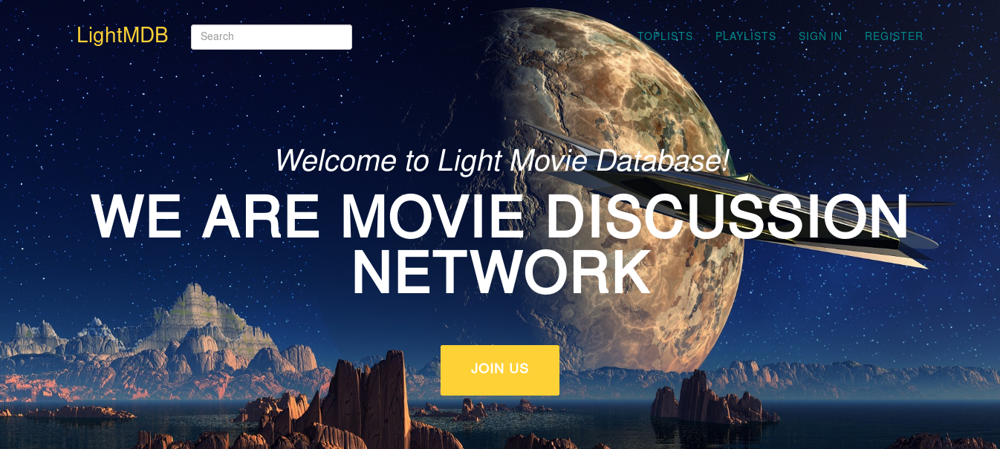

User Guide
==========

* In homepage there is intro about website, Top Movies and Top Users:

* Check Privacy Notice to learn details of information that will be used after registration:

* There is registration and sign in button at navigation, register for website:

* After registration go to profile and check details:

* Profile Page where you can edit details, delete account and write status messages:

* You can navigate to other profile pages and follow people you know:

* When users follow each-other they will be able to chat over direct messaging:

* Search for movies using search bar on top:

* View movie details:

* Also watch movie trailer:

* Administration members will have one extra button in navigation for admin page:

.. toctree::

   member1
   member2
   member3
   member4
   member5
