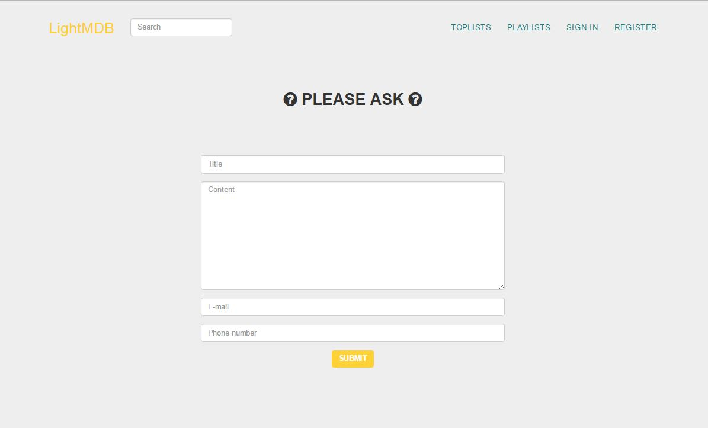
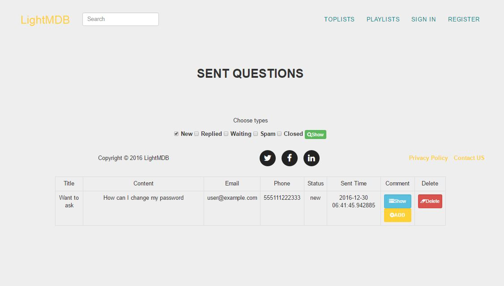
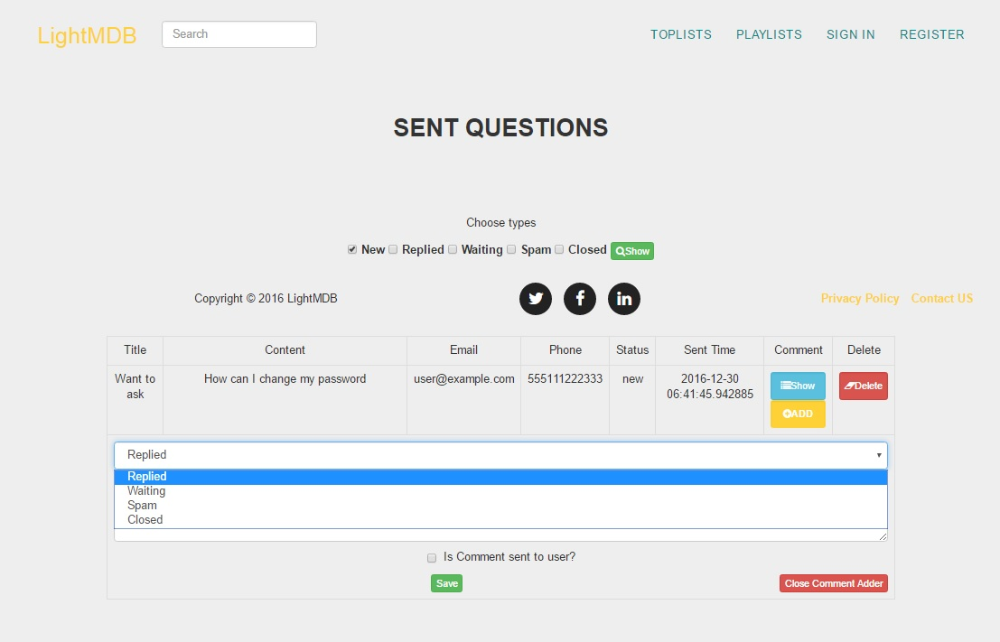
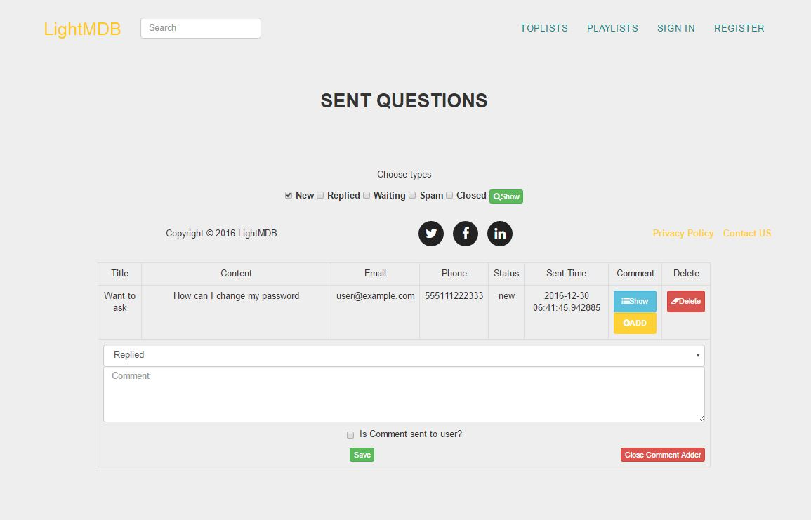
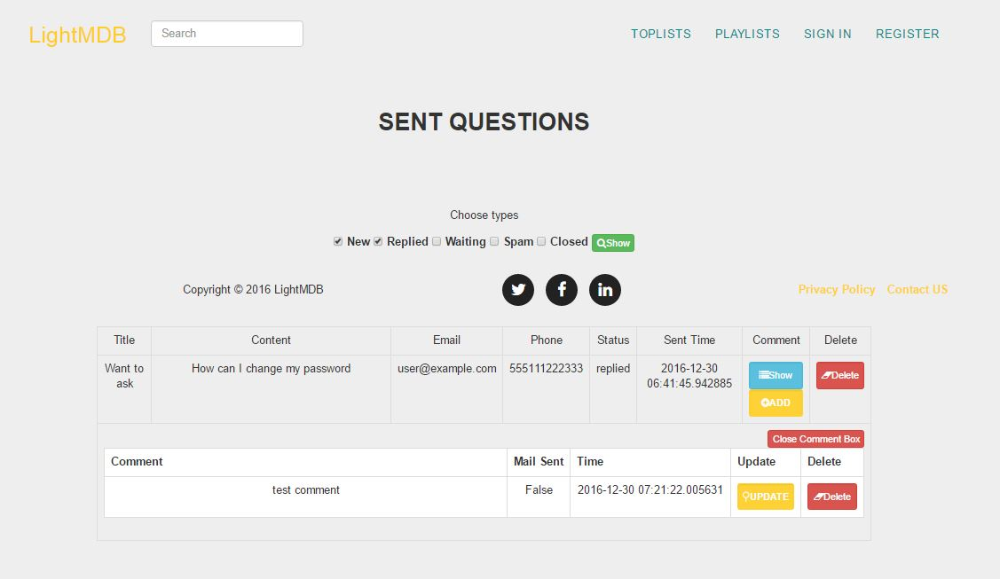
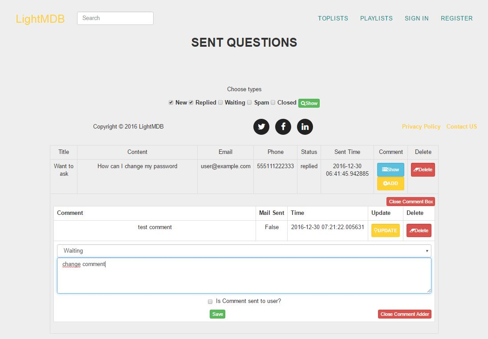

Parts Implemented by Seda Bilgin
================================

###############
CONTACT US PAGE
###############

Users can ask questions by submitting the form on "Contact Us" page. There are some validation controls while submitting the form. For examle users could not submit without an e-mail or enter chracters to phone number.

   
#####################
CONTACT US ADMIN PAGE
#####################

On Admin page users could select sent questions and search and list questions by their status.  Sent questions with "New" status are listed by default. 

   
   
Users also update the status of sent questions by clicking "ADD".
   
   

   
   
########
Comments
########

On Contact admin page users could add comments on sent questions while updating their status. 

   
After clicking "Show" users could see previous comments and update or delete comments.

   
   

